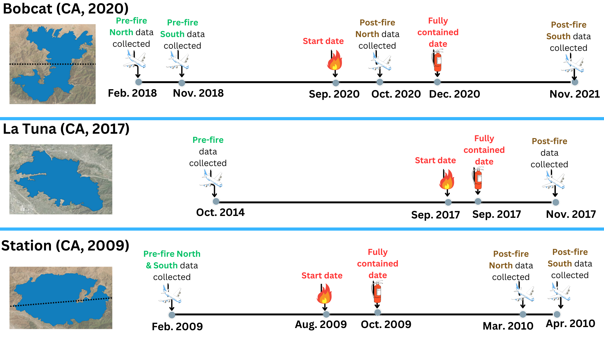

# Classification of UAVSAR Polarimetric Data for Wildfire Monitoring

by Wen Tao Lin (NASA/JPL Summer Internship Program 2023)

#### Abstract
Wildfires are an ongoing threat to communities due to climate change. They are 
characterized by their unpredictability and can lead to severe consequences if not handled 
appropriately. Remote sensing can significantly contribute to wildfire monitoring by providing 
image data over large areas of land. Uninhabited Aerial Vehicle Synthetic Aperture Radar 
(UAVSAR) is a type of active radar sensor well-suited for assessing forest structure due to its 
ability to penetrate the atmosphere under most conditions. We utilize the polarimetric data 
collected from UAVSAR’s L-band radar to detect burn scars and classify fire perimeters. The 
polarimetric data provides valuable insights into the land’s scattering properties, which exhibit 
remarkable sensitivity to forest fuel load, a key indicator for fire burn scars and vegetation burn 
severity. Using classification techniques, we automate the generation of fire perimeters and burn 
severity maps, reducing the manual efforts required. This product will enable real-time wildfire 
monitoring by providing timely updates to aid disaster response and serve as a protype for future 
research in wildfire classification using UAVSAR data. 

#### Summer 2023: [[presentation](summer23_presentation.pdf)] [[report](JPL_sum23_report.pdf)]
This report outlines the methodology and approach utilized in the prototype script developed during the summer of 2023 for classifying fire perimeter and assessing burn severity.

#### Fall 2023: [[presentation](fall24_presentation.pdf)]
1) The enhanced approach implemented to address missing data, refine fire perimeter polygons, and highlight improvements over the product developed in the summer of 2023.
2) A brief analysis of the relationship between UAVSAR polarmetric data and SMAPVEX12's field collected soil moisture. The goal is to use UAVSAR data to estimate field data.

#### Studied Fire

#### Links
1) Uninhabited Aerial Vehicle Synthetic Aperture Radar [(UAVSAR)](https://uavsar.jpl.nasa.gov/)
2) SMAP Validation Experiment 2012 [(SMAPVEX12)](https://smapvex12.espaceweb.usherbrooke.ca/)
